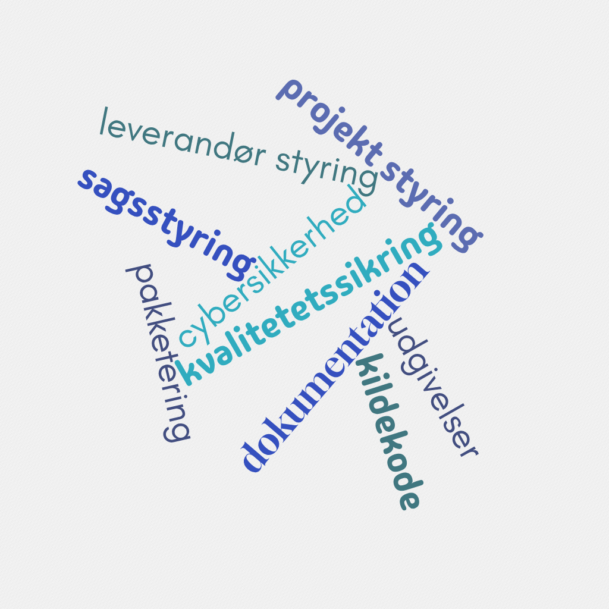

#

### [JAN MAACK KJERBYE]()
*Enterprise Architect*
 
> <small>Jeg brænder for en mere fair og robust offentlig sektor</small>

<!--
Bred erfaring med værdiskabelse fra både private og offentlige orgs.

Jeg brænder for en mere fair og robust offentlig sektor

-->

#

Historie
--> Frivillighed og ildsjæle
--> Proffesionalisering

#
## **Ejerskab**

Fundamentet for ejerskab
:arrow_down:
SINGLE SOURCE OF TRUTH

 
<!-- Lavpraktisk fundament-> Oprettelse af et versions styret hjem i cloud til projektets single source of truth. 
Herunder kildekode, styring af projekt, sager og leverandører, dynamisk dokumentation, kvalitetetssikring, proaktiv cybersikkerhed, løsningspakketering og release management. -->

#

Genbrug

#

Talentudvikling

Freedom of choice
On e.g. vendors for operations, testing, development.

Vendors that 
Play to their strengths

Handlefrihed
Gør det man er god til

Fra reaktiv sikkerhed - Security as a product
One extra add-on product for every product
Detect the symptoms

Til proaktiv sikkerhed - Built in Security
Prevent vulnerabilities from reaching production.

Release strategy
 - Main always deployable
 - Tag releases
 

This makes it easy to trigger automated deployments via webhooks activated on certain tags. E.g. all releases with "testing" can be automatically deployed to a staging environment.

Avoid cascading failures.
No errors is a lie
Catch 95% in tests, contain the rest by isolating them in small independent services.

Vi genbruger de samme internationale metodologier, standarder og principper, som anvendes af virksomheder som IBM, Netflix, Uber, Deutsche Bahn, Mercedes, Novo Nordisk og Velux. Den tyske, franske og hollandske stat og deres storbyer.

Vi arbejder med

Ejerskab
 - Hvordan bliver man ejer af et produkt? Lavpraktisk fundament-> Oprettelse af et versions styret hjem i cloud til projektets single source of truth. Herunder kildekode, styring af projekt, sager og leverandører, dynamisk dokumentation, kvalitetetssikring, proaktiv cybersikkerhed, løsningspakketering og release management.
Transparens
 - Rådgivning om gode vaner og transparente arbejdsgange, fokus på struktur og best-practice standarder.
 - 
versions styring til kildekode,  og dokumentation. Være rådgiver på organisering og arbejdsgange. Jo højere grad af ejerskab jo flere af fordelene kan høstes

Rådgivning om design og løsnings arkitektur. Nedbrydning af løsningsmodeller i domæner og design patterns. Forankring af moderne arkitektur principper som f.eks 12 factor app. Ophæng på leverance og kvalitetsmål fra myndigheden. 

2. Genbrug - Anbefalinger om genbrug ud fra datadrevne projekt principper som "the uniqueness bias fallacy" - lavpraktisk hjælp med identifikation af eksisterende komponenter og løsninger der løser 
3..
4. Rådgivning om hvilke kompetencer der skal være til stede ved leverandørerne til de forskellige opgave kategorier. (Udvikling/vedligehold/kvalitetssikring/udrulning/platformdrift/applikationsdrift/support)
5. 