#

### [JAN MAACK KJERBYE]()
*Enterprise Architect*
 
> <small>Jeg brænder for en mere fair og robust offentlig sektor</small>

<!--
Bred erfaring med værdiskabelse fra både private og offentlige orgs.

Jeg brænder for en mere fair og robust offentlig sektor

-->
#
<!-- class: invert-->

>*Hvad indebærer det at udarbejde en exit-strategi for et produkt, hvorfor er det vigtigt og hvor starter jeg?*

#

> _Many  organizations recognize 
the  benefit  of  a  single  source  of  truth  but  often  lack 
awareness  of  how  to  realize  this  elusive  goal_
> ###### <small><small> :arrow_right: _**Queiroz, Magno & Coltman, Tim. (2024). Data Value and the Search for a Single Source of Truth: What is it and Why Does it Matter?**_</small></small>
#

### **Ejerskab**
:arrow_down:
SINGLE SOURCE OF TRUTH

 
<!-- 
Ejerskab
 - Hvordan bliver man ejer af et produkt? Lavpraktisk fundament-> Oprettelse af et versions styret hjem i cloud til projektets single source of truth. Herunder kildekode, styring af projekt, sager og leverandører, dynamisk dokumentation, kvalitetetssikring, proaktiv cybersikkerhed, løsningspakketering og release management.

Versions styring til kildekode,  og dokumentation. Være rådgiver på organisering og arbejdsgange. Jo højere grad af ejerskab jo flere af fordelene kan høstes
Lavpraktisk fundament-> Oprettelse af et versions styret hjem i cloud til projektets single source of truth. 
Herunder kildekode, styring af projekt, sager og leverandører, dynamisk dokumentation, kvalitetetssikring, proaktiv cybersikkerhed, løsningspakketering og release management. -->

#

>*Hvad skal der til i vores produkt for at andre myndigheder kan tage det i brug?*

#

> _Projektledere og politikere overvurderer konsekvent deres projekters unikke værdi og undervurderer risikoen. Dette er ikke tilfældigt – det er en systematisk psykologisk bias, der får os til at tro, at vores projekt er undtagelsen._
> ###### <small><small> :arrow_right: _**Flyvbjerg (2023), How Big Things Get Done**_</small></small>

#
### **Undgå Unikhedsbias**
:arrow_down:
GENBRUG

<!-- Genbrug - OS² rådgiver og giver lavpraktisk hjælp med identifikation af eksisterende komponenter og løsninger der løser dele af business casen.

Unikhedsbias (også kaldet false-uniqueness effect) er en psykologisk tendens, hvor folk opfatter egne evner, holdninger eller handlinger som mere unikke eller specielle, end de i virkeligheden er

. Dette kan føre til fejlvurderinger af, hvor almindelige eller atypiske ens egenskaber er.
Eksempler fra hverdagen

    En medarbejder tror, at deres problemløsning er helt enestående, selvom lignende løsninger findes i andre afdelinger.

    En projektleder insisterer på, at deres projekt er "helt anderledes" end tidligere projekter, hvilket kan føre til, at erfaringer og lærdom ignoreres

    .

Hvorfor sker det?

    Selvforstærkning: Vi husker bedre vores egne positive egenskaber end andres

Misvisende sammenligninger: Når vi skal vurdere "den gennemsnitlige person", sammenligner vi ofte os selv med en snæver gruppe (f.eks. kolleger i stedet for hele branchen)

Selvbeskyttelse: At føle sig unik kan booste selvtilliden, selvom det ikke altid er realistisk

Konsekvenser i arbejdslivet

    Projekter: Hvis man overvurderer sin projekts unikhed, kan man overse vigtige erfaringer fra lignende projekter, hvilket øger risikoen for forsinkelser eller fejl

Teamarbejde: Medarbejdere kan undervurdere, hvor meget andre bidrager, fordi de fokuserer på deres eget unikke input

Hvordan undgås det?

    Brug referenceklasser: Sammenlign med tidligere projekter eller branchestandarder for at få en mere objektiv vurdering

Spørg kolleger: Få eksterne perspektiver for at afdække blinde vinkler.

"Præmortem"-analyse: Forestil dig, at projektet fejler, og identificer potentielle årsager på forhånd

Kort sagt: Unikhedsbias får os til at tro, at vi eller vores arbejde er mere specielt end det er – en fejlslutning, der kan koste dyrt, hvis den ikke opdages.-->

#

>*Hvordan bygger vi vores produkt så det fungerer sammen med den fælleskommunale digitale arkitektur?*

#

>*Hvordan kan jeg designe vores system så det er mere fremtidssikret og mindre sårbart overfor forandringer?*

#
Transparens
 - Rådgivning om gode vaner og transparente arbejdsgange, fokus på struktur og best-practice standarder.

# Demo 

Hands on example

https://github.com/OS2fleetoptimiser/OS2fleetoptimiser/issues

#
<!-- _header: Flyvbjerg, B., Bruzelius, N., & Rothengatter, W. (2003). Megaprojects and Risk: An Anatomy of Ambition. Cambridge University Press    Kahneman, D. (2011). Thinking, Fast and Slow. Farrar, Straus and Giroux.    Flyvbjerg, B. (2024). "Behavioral Bias". IT-Universitetet i København.-->

<!-- 

Freedom of choice
On e.g. vendors for operations, testing, development.

Vendors that 
Play to their strengths

Handlefrihed
Gør det man er god til

Fra reaktiv sikkerhed - Security as a product
One extra add-on product for every product
Detect the symptoms

Til proaktiv sikkerhed - Built in Security
Prevent vulnerabilities from reaching production.

Release strategy
 - Main always deployable
 - Tag releases
 

This makes it easy to trigger automated deployments via webhooks activated on certain tags. E.g. all releases with "testing" can be automatically deployed to a staging environment.

Avoid cascading failures.
No errors is a lie
Catch 95% in tests, contain the rest by isolating them in small independent services.

Vi genbruger de samme internationale metodologier, standarder og principper, som anvendes af virksomheder som IBM, Netflix, Uber, Deutsche Bahn, Mercedes, Novo Nordisk og Velux. Den tyske, franske og hollandske stat og deres storbyer.

Vi arbejder med

Rådgivning om design og løsnings arkitektur. Nedbrydning af løsningsmodeller i domæner og design patterns. Forankring af moderne arkitektur principper som f.eks 12 factor app. Ophæng på leverance og kvalitetsmål fra myndigheden. 

2. 
3..
4. Rådgivning om hvilke kompetencer der skal være til stede ved leverandørerne til de forskellige opgave kategorier. (Udvikling/vedligehold/kvalitetssikring/udrulning/platformdrift/applikationsdrift/support)
5. 

-->

