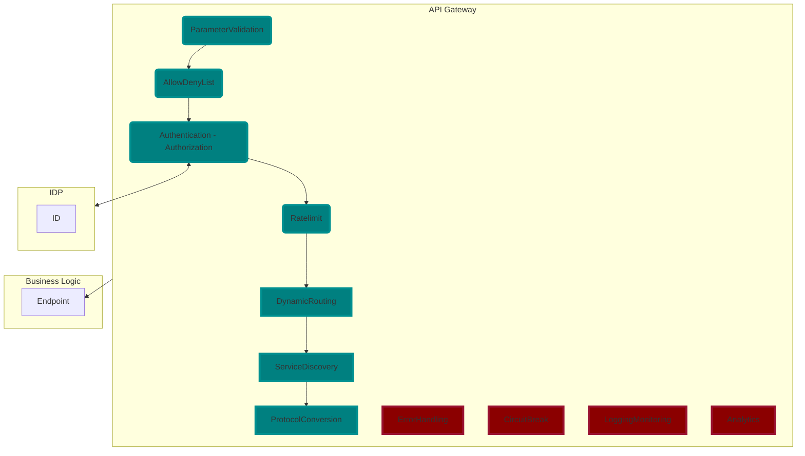

```mermaid

graph TB
    subgraph gw["API Gateway"]
        direction TB
        style PV fill:#008080,stroke:#009090,stroke-width:4px
        style ADL fill:#008080,stroke:#009090,stroke-width:4px
        style AUTH fill:#008080,stroke:#009090,stroke-width:4px
        style RL fill:#008080,stroke:#009090,stroke-width:4px
        style DynamicRouting fill:#008080,stroke:#009090,stroke-width:4px
        style ServiceDiscovery fill:#008080,stroke:#009090,stroke-width:4px
        style ProtocolConversion fill:#008080,stroke:#009090,stroke-width:4px
        style ErrorHandling fill:#8B0000,stroke:#991230,stroke-width:4px
        style CircuitBreak fill:#8B0000,stroke:#991230,stroke-width:4px
        style LoggingMonitoring fill:#8B0000,stroke:#991230,stroke-width:4px
        style Analytics fill:#8B0000,stroke:#991230,stroke-width:4px
        PV(ParameterValidation) -->
        ADL(AllowDenyList)--> AUTH(Authentication - Authorization)
        
        RL(Ratelimit) --> DynamicRouting
        DynamicRouting --> ServiceDiscovery
        ServiceDiscovery --> ProtocolConversion
        Analytics
        ErrorHandling
        CircuitBreak
        ProtocolConversion
        LoggingMonitoring
    end

    subgraph IDP
    ID
    end


    subgraph Business Logic
    Endpoint
    end


    gw----->Endpoint
    AUTH<-->IDP
    AUTH-->RL

```
