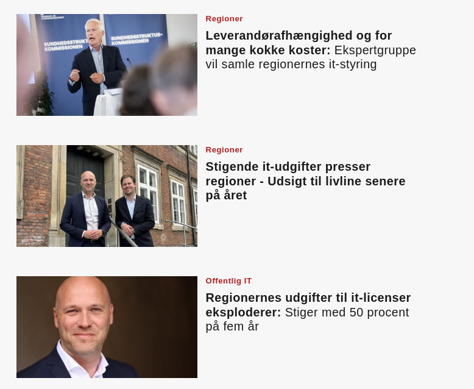

#

<!-- Hvordan adskiller vi os fra et "almindeligt" software produkt -->

### OS2 er en missionsdreven organisation
##
Vi ejer og forvalter produkterne i fælleskab.

#
## Missionen understøttes af rammer
Via fælles governance

##
###### :eye: Transparens | :bank: Standarder | :books: Kultur
##
<!--Rammerne er som trapper med gelændre imellem forskellige niveauer -->

# 
## Rammerne skaber nye friheder
Til at vælge det der er vigtigt 

# 
## Friheder
🧠 **Faglighed** over fortjeneste 
###### 🧮 **Læringskultur** erstatter 0-fejls kultur
###### 🤝 **Samarbejde** fremfor intern konkurrence
###### 💰 **Investeringer** istedet for interimistiske løsninger

<!-- Besparelser er ikke målet-->

# 
## Friheder
###### 🧠 **Faglighed** over fortjeneste 
🧮 **Læringskultur** erstatter 0-fejls kultur
###### 🤝 **Samarbejde** fremfor intern konkurrence
###### 💰 **Investeringer** istedet for interimistiske løsninger
 
#

## Rammerne operationaliseres i 
Rådgivning | Tekniske skabeloner | Løbende revision

#

Exit strategi by design - not by afterthought

#
 Hvis vi skal imødegå de udfordringer offentlig IT står med skal vi starte fra bunden!

#
> **Hver fjerde statslige it-projekt er kørt af sporet:**
>  Væsentlige forsinkelser og fordyrelser forude
#

> **Langvarig forsinkelse af nyt sygesikringssystem:** Slår bunden ud af Kombits regnskab

> **Regionernes udgifter til it-licenser eksploderer:** Stiger med 50 procent på fem år