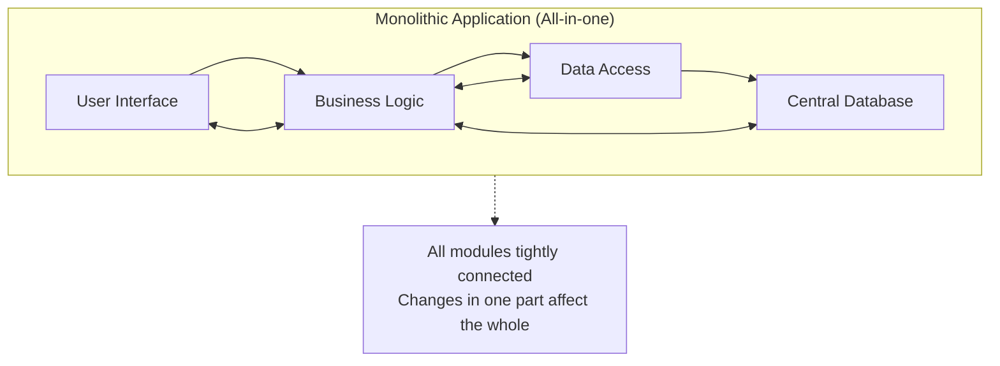
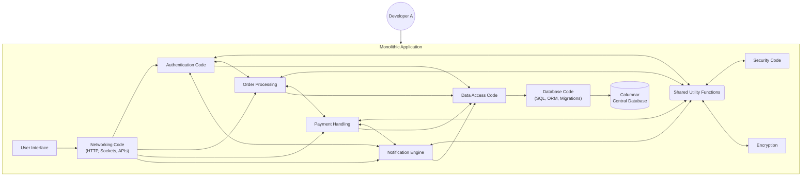
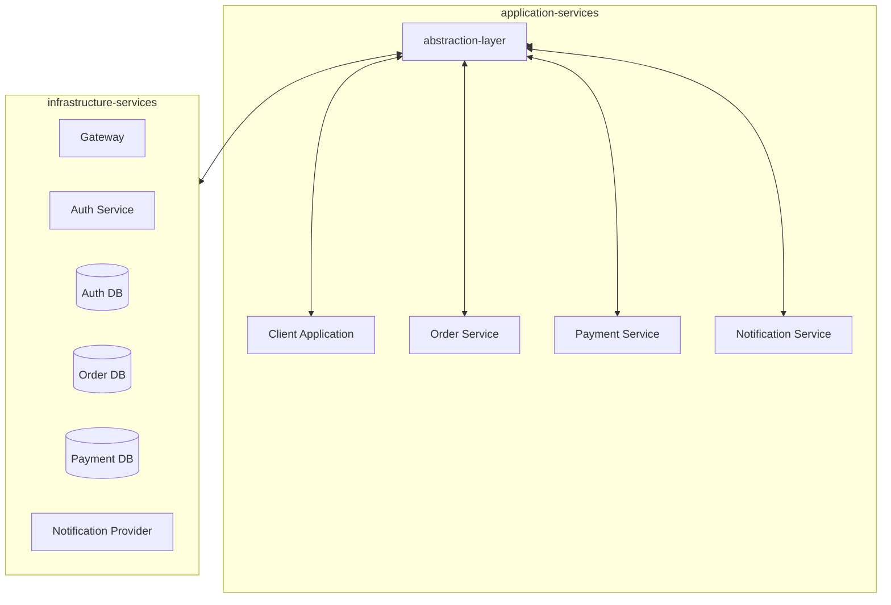

# Principle: Simple and fast to get started
_Make things simple for ME
Implementations: Monoliths for Mvps or Pocs with onle a few developers

 

# ⏬

# Principle: Seperation of Concerns
_Let developers play to their strengths_

Implementation: Services

