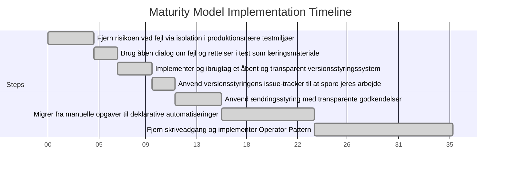

#

 
> _If you imagine that your project is so different from other projects that you have nothing to learn from them, you will overlook risks that you would catch and mitigate if you instead switched to the outside view._

<!-- _footer: _Prof. Flyvbjerg, IT University of Copenhagen - How Big Things Get Done (2022)_ -->

# 
#### Et digitalt suverænt fundament 

#
## Hvordan gemmer du?

<!-- Versionsstyring -->

# 🧠

Vær åben og modig!

Lad maskinerne arbejde for dig

Stil din viden åbent til rådighed for flere

<!-- Dether er nyt
 Tænk i proaktive baner ikke reaktive mønstre
Specialiser dig i det du interesserer dig for  -->

# 🤝

Genbrug

Arbejd sammen med en kollega

Aflever resultatet så andre kan bruge det

# 🛠️

- Øv jer i at skelne mellem den stillede opgave og den teknologi der kan anvendes til at løse den
- Opdel jeres løsning i mindre dele der løser et problem ad gangen
- Foretræk teknologier og løsninger med åbne tilgængelige snitflader

# 🚶Køreplan for trinvis modenhed i praksis

#
## Lad maskinen løfte det tunge
##### Beskriv desired state
<!--- Operator pattern---> 

#

## Lav flere fejl!
##### Men isoler dem 

<!--Fjern risikoen forbundet med fejl via isolation i produktionsnære testmiljøer
*Test i sikre omgivelser, så fejl ikke påvirker drift.*
Tal om fejlene og lær af dem
*Skab en kultur hvor fejl ses som læring, ikke som fiasko.*
-->

#

3. Implementer og ibrugtag et åbent og transparent versionsstyringssystem
*Få styr på kode og konfiguration med versionskontrol.*

4. Anvend versionsstyringens indbyggede issue-tracker til at spore jeres arbejde
*Skab overblik og ansvarlighed i opgavehåndtering.*

5. Anvend versionsstyringens indbyggede ændringsstyring med transparente godkendelser
*Indfør godkendelsesflows og sporbarhed i ændringer.*

6. Migrer trinvist væk fra personbundne gentagne manuelle opgaver til deklarative automatiseringer og aflever disse i versionsstyring
*Automatisér og dokumentér processer for at sikre skalerbarhed og robusthed.*

7. Fjern skriveadgang for medarbejdere til produktionssystemer og implementer et Operator Pattern
*Indfør fuld kontrol og sikkerhed i produktionsmiljøet gennem automatiserede og godkendte handlinger.*

#
###### **SINGLE SOURCE OF THRUTH**

 
 
 
 

#
- Udnyt overlap imellem digital handlefrihed og et sundt digitalt beredskab
- Start fra bunden og implementer læring og nye arbejdsgange i små trin

# Hvad kan vi gøre?

#

<small>

| **Digital Uafhængighed**                  | **Digitalt Beredskab**                          | **Fælles Gevinst**                              |
|------------------------------------------|------------------------------------------------|------------------------------------------------|
| Undgå vendor lock-in                     | Redundans og failover                          | Øget robusthed og handlefrihed                 |
| Selvhostede eller kontrollerede løsninger| Kontrol over kritisk infrastruktur             | Hurtigere reaktion ved nedbrud eller angreb    |
| Open source og gennemsigtighed           | Proaktiv audit og øget gennemsigtighed                   | Øget tillid og compliance                      |
| Infrastruktur som kode                   | Hurtig genetablering ved nedbrud               | Automatiseret genopretning og dokumentation    |
| Lokal datalagring og kryptering          | Beskyttelse mod datalæk og cyberangreb         | Bedre datasikkerhed og GDPR-overholdelse       |

#

### Anvendte Arkitekturprincipper
 
 Declarative Configuration Pattern | Reconciliation Loop Pattern     | Operator Pattern 
 
  Immutable Infrastructure Pattern  | Event-Driven Automation Pattern

  Pull-Based Deployment Pattern | Audit and Observability Pattern
  
  Separation of Concerns | Single Source of Truth

