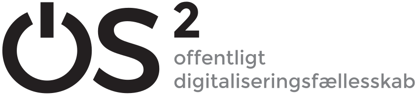

#


### [JAN MAACK KJERBYE]()
*Enterprise Architect OS²*
<!-- _footer: "jan@os2.eu" -->


<!--
Bred erfaring med værdiskabelse fra både private og offentlige orgs.

Jeg brænder for en mere åben og robust offentlig sektor

-->


#
<!-- class: invert -->


> _The architecture function is often seen as inseparable from essential governance and compliance requirements. However, reducing the role of architecture to a compliance function or separating it from day-to-day operations confines its value to a policing entity or an abstract function in an ivory tower."_
> 
> ###### [:arrow_right: McKinsey Digital Insights](https://www.mckinsey.com/capabilities/mckinsey-digital/our-insights/tech-forward/quantum-technology-use-cases-as-fuel-for-value-in-finance)

# **FORHINDRINGER**


<!--
Men hvorfor genbruger vi så ikke.?
Det kan ikke passe at det giver så stor værdi og at vi ikke gør det?
Klassisk filosofisk fejlslutning
Vi sidder også i trakfikpropper næsten hver dag 
En digital trængsel
Alle mand for sig selv
Jeg har flere gange siddet i en "lynbus" på E45 denne sommer
Det var ikke p.g.a. bussen at vi ikke kom frem, det var p.g.a. trængsel.


-->
#

## **1. Ingen samlende koncensus**
<!--        - Indkøb eller fælles anvendelse italesættes som genbrug 
Der kan ikke findes en officiel definition at følge
Og vi har ikke som myndigheder besluttet at deltage i et genbrugs fælleskab-->
2. Teknik over strategi
3. Indkøbs mindset


<!-- transition: glow -->

#

1. Ingen samlende koncensus
## **2. Teknik over strategi**
<!--    - Drevet af ildsjæle ofte teknikere
    - Fokus på teknik istedet for strategi 
    Manglen-->
3. Indkøbs mindset


#


1. Ukoordinerede og lokale indsatser
2. Udvanding af genbrugs begrebet
### **3. Indkøbs mindset**

<!--   
    - Manglende fokus på strategi og fremtids sikring
    
    - Tendens til at opfinde nye metoder for hver indsats istedet for genbrug af metoder

- Håndteres som "feature complete" indkøb
- Feature complete
-  Indkøb og kravspec skillsets risikerer at stå i vejen isteder for at hjælpe
- Teams med evner for kontinuerlig forbedring 
    
-->
#
<!-- transition: swipe -->

## **FORUDSÆTNINGER**
### 🔃


Forankring - Fælles forståelse - Fundamentale friheder
<!--
1. Koordination og ensartede måder at opdage og identificere software.
2. Fælles metoder og standarder for deling.
3. Robuste konstruktioner (communities) der kan gøres person og organisations uafhængige. 

 Software Engineering with Reusable Components
 - Johannes Sametinger - Institut für Wirtschaftsinformatik, Johannes-Kepler-Universität Linz, Linz, Austria
https://scholar.google.com/citations?hl=da&user=92HPqbEAAAAJ

Software Reuse
CHARLES W. KRUEGER
School of Computer Science, G’arnegie Mellon University, Pittsburgh, Pennsylvania 15213
Soft

Introduction to Software Reuse
Jacob L. Cybulski - https://scholar.google.com/citations?user=H3RAsPIAAAAJ&hl=da&oi=ao
Department of Information Systems
The University of Melbourne

-->

# **OPEN SOURCE**
leverer rammerne

###### Frihed til at bruge, undersøge, dele og modificere

<!-- Genbrug og transparens er indbygget i OSS-->

# **ORGANISERING**


<!--

- Containerbuilds, GitHub hosting, projekt og dokumentations skabeloner
- Bidrag til upstream IDP med SAML krypterings funktioner der sikrer interoperabilitet med den danske digitale infratruktur. Implementering og anvendelse internt som "Customer-0" og udbredelse til andre OS2 produkter
- Bidrag til ensartet, søgbare tekniske dokumentationsportaler via "docs-as code" principper og automatisering

-->
# **METODER**
standard open source & best practices


###### :cloud: **Sharing & managing** - git+github&ensp;**|**&ensp; 📦 **Packaging** - open containers
###### :arrows_counterclockwise: **Documentation** - docs-as-code &ensp;

###### 🤝 **Communities** - async real-time chat


#
## **BIDRAG**
```python
    
     def get_encryption_key_descriptor(self) -> Optional[Element]:  
        """Get Encryption KeyDescriptor, if enabled for the source"""
        if self.source.encryption_kp:
            key_descriptor = Element(f"{{{NS_SAML_METADATA}}}KeyDescriptor")
            key_descriptor.attrib["use"] = "encryption"
            key_info = SubElement(key_descriptor, f"{{{NS_SIGNATURE}}}KeyInfo")
            x509_data = SubElement(key_info, f"{{{NS_SIGNATURE}}}X509Data")
            x509_certificate = SubElement(x509_data, f"{{{NS_SIGNATURE}}}X509Certificate")
            x509_certificate.text = strip_pem_header(
                self.source.encryption_kp.certificate_data.replace("\r", "")
            ).replace("\n", "")
            return key_descriptor
        return None


    def _decrypt_response(self):
        """Decrypt SAMLResponse EncryptedAssertion Element"""
        manager = xmlsec.KeysManager()
        key = xmlsec.Key.from_memory(
            self._source.encryption_kp.key_data,
            xmlsec.constants.KeyDataFormatPem,
        )


```
<!-- _footer : "[contributor](https://github.com/nicolas-semaphor?tab=overview&from=2023-04-01&to=2023-04-30) - [issue](https://github.com/goauthentik/authentik/issues/7999) - [contribution](https://github.com/goauthentik/authentik/pull/10099) &nbsp;&nbsp;&nbsp;&nbsp;&nbsp;&nbsp;&nbsp;&nbsp;&nbsp;&nbsp;&nbsp;&nbsp;&nbsp;&nbsp;&nbsp;&nbsp;&nbsp;&nbsp;&nbsp;&nbsp;&nbsp;&nbsp;&nbsp;&nbsp;&nbsp;&nbsp;&nbsp;&nbsp;&nbsp;&nbsp;&nbsp;&nbsp;&nbsp;&nbsp;&nbsp;&nbsp;&nbsp;&nbsp;&nbsp;&nbsp;&nbsp;&nbsp;&nbsp;&nbsp;&nbsp;&nbsp;&nbsp;&nbsp;&nbsp;&nbsp;&nbsp;&nbsp;&nbsp;&nbsp;&nbsp;&nbsp;&nbsp;&nbsp;&nbsp;&nbsp;&nbsp;&nbsp;&nbsp;&nbsp;&nbsp;&nbsp;&nbsp;&nbsp;&nbsp;&nbsp;&nbsp;&nbsp;&nbsp;&nbsp;&nbsp;&nbsp;&nbsp;&nbsp;&nbsp;&nbsp;&nbsp;&nbsp;&nbsp;&nbsp;&nbsp;&nbsp;&nbsp;&nbsp;&nbsp;&nbsp;&nbsp;&nbsp;&nbsp;&nbsp; " -->

<!--
En helt github grøn udvikler
Et spørgsmål til et eksisterende projekt
Et bidrag til et fælles vedligeholdt projekt
-->