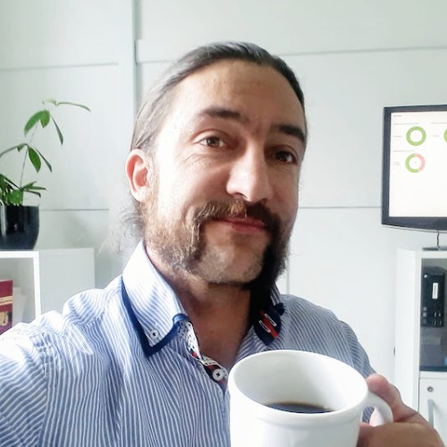

#


<style scoped>
  img {
  width:200px;
  border-radius: 50%;
    }
</style>

### [JAN MAACK KJERBYE]()
*Enterprise Architect OS²*
<!-- _footer: "jan@os2.eu" -->


<!--
Bred erfaring med værdiskabelse fra både private og offentlige orgs.

Jeg brænder for en mere åben og robust offentlig sektor

-->


#
<!-- class: invert -->


> _The architecture function is often seen as inseparable from essential governance and compliance requirements. However, reducing the role of architecture to a compliance function or separating it from day-to-day operations confines its value to a policing entity or an abstract function in an ivory tower."_
> 
> ###### [:arrow_right: McKinsey Digital Insights](https://www.mckinsey.com/capabilities/mckinsey-digital/our-insights/tech-forward/quantum-technology-use-cases-as-fuel-for-value-in-finance)

# Forhindringer


<!--
Vi starter lidt let med en analogi.
Analogi: Lidt ligesom en trafikprop i et afrikansk land
Alle har mere eller mindre samme mål
Alle løser det individuelt, f.eks ved at sidde i egen bil
Selv folk der har valgt at tage en bus sammen med andre sidder fast og kommer ingen vegne.
Nogen kører måske decideret imod kørselsretningen
Nogle bliver utålmodige og maser sig ud i nødspor eller på fortov eller helt uden for vejen og sidder fast i mudderet.
Kaos!
Fremadstormende tech giganter som Elon Musk "løser det" ved at sælge planer om borede tuneller under vejene, begynder at bore i Californien og så hører man ikke rigtigt mere til det.
-->
#


## Forhindringer
### **1. Ukoordinerede og lokale indsatser**
<!--    - Drevet af ildsjæle ofte teknikere
    - Fokus på teknik istedet for strategi -->
2. Udvanding af genbrugs begrebet
3. Drevet som tidbegrænsede projekter

#


## Forhindringer
1. Ukoordinerede og lokale indsatser
### **2. Udvanding af genbrugs begrebet**
<!--        - Indkøb eller fælles anvendelse italesættes som genbrug -->
3. Drevet som tidbegrænsede projekter

#

## Forhindringer
1. Ukoordinerede og lokale indsatser
2. Udvanding af genbrugs begrebet
### **3. Drevet som tidbegrænsede projekter**
<!--    - Ringe forudsætningsanalyser p.g.a. manglende domæneviden
    - Manglende fokus på strategi og fremtidd sikring
    - Tendens til at opfinde nye metoder for hver indsats istedet for genbrug af metoder
    - Teams med evner for kontinuerlig forbedring 
Ikke Indkøb og kravspec skillsets risikerer at stå i vejen
-->
#
## **Forudsætninger**
for GENBRUG
## 🔃
###### Kvalificeret af andre, ukompliceret at dele, nemt at tilgå, gennemskueligt. 


<!--
Der mangler en forankring - Er der noget man gør eller er det en strategisk ramme?

Der mangler en fælles forståelse af, 
hvad begrebet **genbrug** præcist indbefatter eller hvilken værdi man forventer

Properitært? En Kopi? Indkøb af samme teknologi?

Hvis folks selv må definere det kommer vi ingen vegne.

#### Manglende akkumuleret viden om OSS

Forsøg med genbrug identificeres ikke nødvendigvis med Open Source, da der er meget lidt akkumuleret viden om OSS i danske myndigheder.

#### Fragmenteret viden om initiativer

Der er meget begrænset opsamlet statistik eller succeshistorier om initiativer i den danske offentlige sektor. Mange kilder peger på op til 10 år gamle kilder.

[Interactive Resource Map | Joinup](https://joinup.ec.europa.eu/collection/open-source-observatory-osor/interactive-resource-map)

# Mine erfaringer med forsøg på genbrug

Baseret på min erfaring falder forsøg med forskellige fortolkninger af genbrug, lidt groft sagt, indenfor fire kategorier. 

### :handshake: Den indidviduelle og manuelle

   Ildsjæle i de mellemste organisatoriske lag af myndighederne,  benytter netværksmøder, personlige kontakter, email anmodninger, og uensartede fremgangsmådet til at fremskaffe programmer og dokumentation på software der håbes genbrugt. Det indebærer mange personafhængige flaskehalse og processen kan være meget langsom og uforudsigelig. I nogle tilfælde dukker disse ildsjæle op igen i anden kontekst involveret i Open Source projekter.

   Risiko: *Bestilleren kan ikke vente og mister tålmodigheden, projektet falder til jorden or et med til at underbygge generelle misforståelser og myter om genbrug af software*.

### :money_with_wings: Den vedligeholdelsestunge

   Der investeres mange timer og penge i at etablere officielle offentlige portaler, med custom søgemaskiner og applikationsdatabaser baseret på indmeldinger og manuel opmærkning. Det viser sig at været så tungt i både teknisk og administrativt vedligehold at det bliver voldsomt dyrt at vedligeholde og meget svært at finde financiering til.

  Risiko:  *Den økonomiansvarlige tvivler på værdiskabelsen, holdt op imod investeringerne og stopper funding.* 

### 🙈 Den udliciterende

    Alle myndigheder placerer deres æg i samme kurv og køber væg-til-væg løsninger f.esk ved en af de store amerikanske tech giganter. Der skal opmandes på juridiske kompetencer til leverandør og licensstyring og myndighederne må tilpasse sig til løsningerne. Selvom man teknisk set "gen"bruger de samme løsninger, må man acceptere et tab af ejerskab og indflydelse.

    Risiko: *Leverandøren kan ved hjælpe af de-facto leverandør lock-in prissætte sine ydelser udelukkende efter deres kommercielle forretningsmodeller og regninger til licenser eskalerer ud af kontrol*

### :people_holding_hands: Det samarbejdskrævende alternativ

    Der genbruges eksisterende åbne delingsportaler til Open Source og investeres i åbne vidensfællskaber, der aktiverer det private SMV lag og arbejder inkrementelt med tilpasninger af eksisterende løsninger.

    Risiko: *Vanetænkning og frygt forhindrer at den nødvendige tillid til OSS kan nåes, og projekterne strander dybt nede i it-adfelingerne*

#

 Software Engineering with Reusable Components
 - Johannes Sametinger - Institut für Wirtschaftsinformatik, Johannes-Kepler-Universität Linz, Linz, Austria
https://scholar.google.com/citations?hl=da&user=92HPqbEAAAAJ

Software Reuse
CHARLES W. KRUEGER
School of Computer Science, G’arnegie Mellon University, Pittsburgh, Pennsylvania 15213
Soft

Introduction to Software Reuse
Jacob L. Cybulski - https://scholar.google.com/citations?user=H3RAsPIAAAAJ&hl=da&oi=ao
Department of Information Systems
The University of Melbourne

-->

# **OPEN SOURCE**
leverer rammerne


<!-- Genbrug og transparens er indbyggede faktorer-->

##### **Transparency** | **Availability** | **Uniformity**
ReUse

# **METODER**


###### :cloud: **Design** - 15 factor app &ensp;**|**&ensp; 📦 **Packaging** - OCI containers
###### :arrows_counterclockwise: **Documentation** - Docs-as-Code &ensp;**|**&ensp; ⚙️ **Deployment** - GitOps
###### :arrow_double_up: **Maintenance** - Upstream first

<!--

- Containerbuilds, GitHub hosting, projekt og dokumentations skabeloner
- Bidrag til upstream IDP med SAML krypterings funktioner der sikrer interoperabilitet med den danske digitale infratruktur. Implementering og anvendelse internt som "Customer-0" og udbredelse til andre OS2 produkter
- Bidrag til ensartet, søgbare tekniske dokumentationsportaler via "docs-as code" principper og automatisering

-->
#
### **BIDRAG**
```python
    
     def get_encryption_key_descriptor(self) -> Optional[Element]:  
        """Get Encryption KeyDescriptor, if enabled for the source"""
        if self.source.encryption_kp:
            key_descriptor = Element(f"{{{NS_SAML_METADATA}}}KeyDescriptor")
            key_descriptor.attrib["use"] = "encryption"
            key_info = SubElement(key_descriptor, f"{{{NS_SIGNATURE}}}KeyInfo")
            x509_data = SubElement(key_info, f"{{{NS_SIGNATURE}}}X509Data")
            x509_certificate = SubElement(x509_data, f"{{{NS_SIGNATURE}}}X509Certificate")
            x509_certificate.text = strip_pem_header(
                self.source.encryption_kp.certificate_data.replace("\r", "")
            ).replace("\n", "")
            return key_descriptor
        return None


    def _decrypt_response(self):
        """Decrypt SAMLResponse EncryptedAssertion Element"""
        manager = xmlsec.KeysManager()
        key = xmlsec.Key.from_memory(
            self._source.encryption_kp.key_data,
            xmlsec.constants.KeyDataFormatPem,
        )


```
<!-- _footer : "[contributor](https://github.com/nicolas-semaphor?tab=overview&from=2023-04-01&to=2023-04-30) - [issue](https://github.com/goauthentik/authentik/issues/7999) - [contribution](https://github.com/goauthentik/authentik/pull/10099) &nbsp;&nbsp;&nbsp;&nbsp;&nbsp;&nbsp;&nbsp;&nbsp;&nbsp;&nbsp;&nbsp;&nbsp;&nbsp;&nbsp;&nbsp;&nbsp;&nbsp;&nbsp;&nbsp;&nbsp;&nbsp;&nbsp;&nbsp;&nbsp;&nbsp;&nbsp;&nbsp;&nbsp;&nbsp;&nbsp;&nbsp;&nbsp;&nbsp;&nbsp;&nbsp;&nbsp;&nbsp;&nbsp;&nbsp;&nbsp;&nbsp;&nbsp;&nbsp;&nbsp;&nbsp;&nbsp;&nbsp;&nbsp;&nbsp;&nbsp;&nbsp;&nbsp;&nbsp;&nbsp;&nbsp;&nbsp;&nbsp;&nbsp;&nbsp;&nbsp;&nbsp;&nbsp;&nbsp;&nbsp;&nbsp;&nbsp;&nbsp;&nbsp;&nbsp;&nbsp;&nbsp;&nbsp;&nbsp;&nbsp;&nbsp;&nbsp;&nbsp;&nbsp;&nbsp;&nbsp;&nbsp;&nbsp;&nbsp;&nbsp;&nbsp;&nbsp;&nbsp;&nbsp;&nbsp;&nbsp;&nbsp;&nbsp;&nbsp;&nbsp; " -->

<!--
En helt github grøn udvikler
Et spørgsmål til et eksisterende projekt
Et bidrag til et fælles vedligeholdt projekt
-->