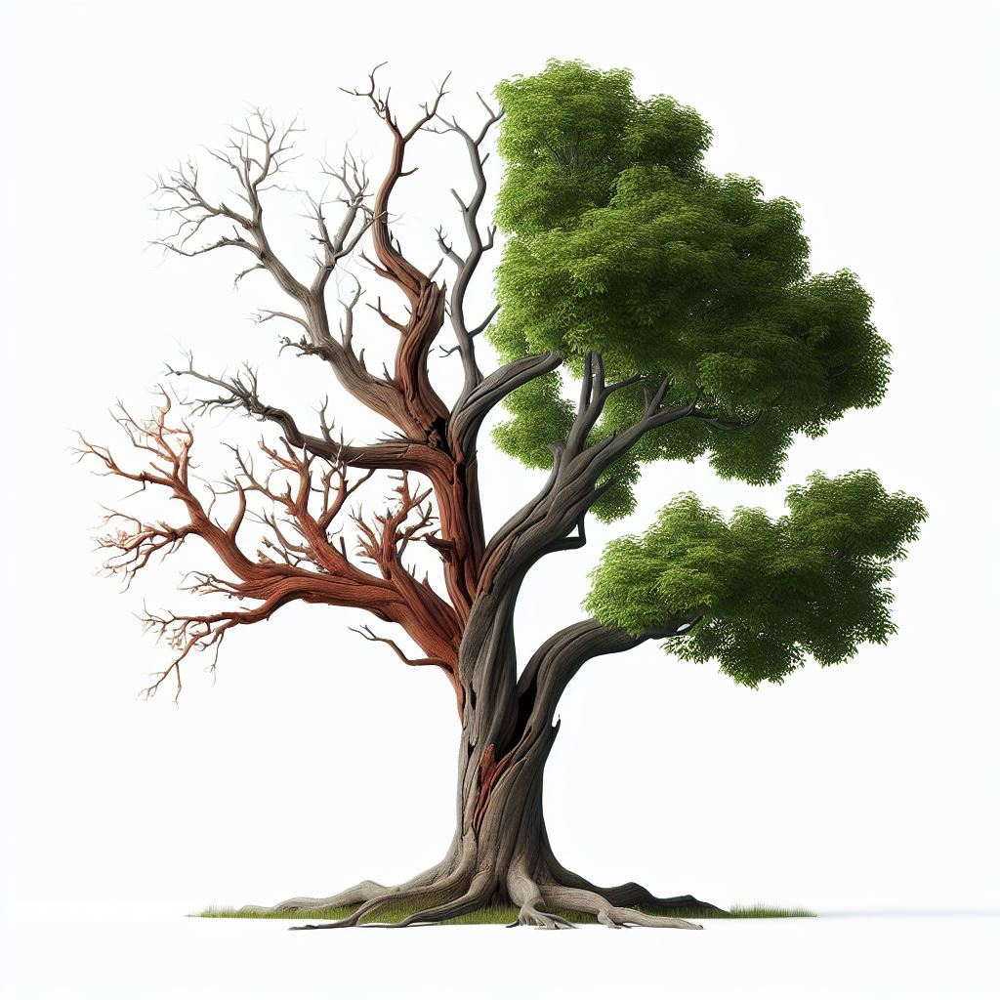

#
## **JAN KJERBYE**

*Enterprise Architect*

<!-- _footer:  |
    <i class="fa-brands fa-linkedin"></i> LinkedIn: [jankjerbye](https://www.linkedin.com/in/jankjerbye/)| <i class="fa-brands fa-github"></i> GitHub: [janhalen](https://github.com/janhalen) | <i class="fa-solid fa-envelope"></i> Email: [jan@os2.eu](mailto:jan@os2.eu)
-->

<!--
Bred erfaring med værdiskabelse fra både private og offentlige orgs.

Jeg brænder for en mere åben og robust offentlig sektor
-->

#
<!-- _) -->

<!-- class: invert -->

> _..reducing the role of architecture to a compliance function or separating it from day-to-day operations confines its value to a policing entity or an abstract function in an ivory tower."_
> 
> ###### [:arrow_right: McKinsey Digital Insights](https://www.mckinsey.com/capabilities/mckinsey-digital/our-insights/tech-forward/quantum-technology-use-cases-as-fuel-for-value-in-finance)

# 
<!-- _class: -->

> _Unikhedsbias påvirker os alle. Vi er tilbøjelige til at tro, at vores situation, kompetencer, kollegaer eller organisation er helt unikke._

#

_The Enterprise is dead

:

Long live the Enterprise_

# **FREE**

_as in Speech,_ 
_not as in beer_

# Strategiske
##### **_teknologivalg_**

# Sæt myndighederne fri

##### **_Risikofrie overgange_**
##### **_operationel integritet_**
<!-- Open source technology ensures the longevity of
 assets by eliminating the risks associated with
vendor lock-in. Unlike closed systems, where reliance
on a single vendor can lead to challenges in
maintenance and end-of-life scenarios, open access
to underlying technology allows for seamless
transitions between vendors and technology stacks. This flexibility
empowers stakeholders to adapt to changing
circumstances without disrupting the operational
integrity of their systems -->

#
##### **Et spring ud i en robust, tilpasningsdygtig fremtid**
OS² har ikke midlerne til at være unikke
Vi kan ikke udvikle og vedligeholde unik dansk teknologi
Vi vælger derfor levende teknologi i bevægelse og tilpasser den
<!--    * Industry is undergoing rapid transformation,
        *  embracing open source offers a multitude of benefits that  enhance long-term sustainability, flexibility and innovation. * *  For stakeholders accustomed to proprietary solutions, understanding the advantages open source becomes crucial for navigating the evolving landscape
        mitigating vendor lock-in to fostering rapid innovation and ensuring robust security, open source stands as a reliable
and future-proof alternative for energy industry stakeholders seeking a dynamic, flexible, and sustainable
technological foundation. Embracing open source is not just a paradigm shift; it is a strategic leap towards
a resilient, adaptable, and innovative energy future. -->

# OS²
Er medlemsfinansieret
Har kun offentlige myndigheder som medlemmer
Leverer ikke afkast til aktionærer
Sælger ikke produkter!

#
### De Fire Friheder i Open Source
<small>

|               |                                                                  |
|---------------------------|---------------------------------------------------------------------------------|
| **Frihed til at bruge**  ✔ Brug softwaren frit til ethvert formål.   |   **Frihed til at studere** ✔ Tilpas kildekoden til dine behov.                      |
| **Frihed til at dele** ✔ Del softwaren med andre.   | **Frihed til at forbedre** ✔ Forbedr softwaren og del ændringerne. | 

</small>

# Ingen billige tricks

if you cant beat them join them?

#
Instant Photos

<!--forbrugerdrevet teknologi -->
#

UPSTREAM FIRST

> _The more changes you make in your fork, the more expensive it can become to maintain. You will find that the changes you are making are not exclusive to your company or infrastructure because the problems you solve with your changes are just as much of a problem to other people than they are to you._
> ###### [:arrow_right: Max Michels - Apache Software Foundation](https://maximilianmichels.com/2021/upstream-first/)
# Samskabelse
Vi genbruger standard principper til at sikre OS2 løsningernes relevans og fremtidssikring.

<small><small>
[Upstream First](https://en.wikipedia.org/wiki/Upstream_first) | [Upstream First](https://maximilianmichels.com/2021/upstream-first/)
</small></small>

<!-- Dette princip handler om at bidrage til de projekter, man anvender, for at sikre bæredygtighed og fremtidssikring. Det kan være ved at bidrage med kode, dokumentation eller ved at deltage i diskussioner om projektets retning og udvikling. --> 

#

> _The pessimist complains about the wind. The optimist expects it to change. The realist adjusts the sails._

<small>
Hvornår brugte i sidst VHS? Polaroid?
</small>

#
#### ARKITEKTURMÅL :cloud:

###### Løskoblede API first services, pakket som selvstændige letvægts containere
###### Fokus på standardisering og genbrug
###### Automatisk byg og implementering
###### Decentraliseret storage og stateless core

# Ejerskab
Partnerskaber mellem kommuner kan aktivt deltage i udviklingen af open source-komponenter, hvilket fremmer teknisk udveksling og videndeling.

#
2. "API First"

Med API First-design prioriteres udvikling af robuste og veldokumenterede API'er:

Vi viser vejen til handlefrihed
    Interoperabilitet: Gør det muligt for forskellige systemer at kommunikere og dele data effektivt.
    Modularitet: Gør det muligt for forskellige offentlige myndigheder at integrere digitale løsninger uden afhængighed af specifikke platforme.

    Åbenhed: Vi skaber fælles grænseflade for samarbejde mellem kommuner og regioner.

    Skalerbarhed: En API-drevet tilgang muliggør nem tilføjelse af nye funktioner uden at påvirke eksisterende systemer.
#
3. 12-Factor App Metodologi

Denne metodologi sikrer moderne, skalerbare applikationer, der er nemme at vedligeholde:

    Stateless Processer: Applikationerne kan skaleres horisontalt, hvilket understøtter behovsdrevne løsninger

.

Konfigurationsstyring: Adskillelse af konfiguration fra kode muliggør fleksibilitet på tværs af miljøer (udvikling, test, produktion)

Dev/Prod Parity: Ensartede miljøer reducerer fejl og øger pålideligheden af digitale løsninger

    .
#

5. Cloud-Native Principper

Cloud-native arkitektur fremmer innovation gennem mikroservices, containerisering og automatisering:

    Mikroservices: Tillader små teams at arbejde uafhængigt på forskellige dele af en løsning, hvilket øger agiliteten

.

Containerisering: Brug af Docker/Kubernetes sikrer skalerbarhed og robusthed

    .

    CI/CD: Kontinuerlig integration og levering muliggør hurtigere innovation og implementering.

Ved at integrere disse principper i OS2's rammer kan man skabe bæredygtige digitale løsninger baseret på åbenhed, samarbejde og innovation – til gavn for hele det offentlige Danmark.

# Vi genbruger standard playbooks

SRE / DevOps
12 factor app
openssf baseline

declarative code --> GitOps

#

###### [SAML encryption PR](https://github.com/goauthentik/authentik/pull/10099)

###### [E-ID / SDG klar](https://github.com/digitalist-se/sdg-php-client/blob/main/src/SDGClient.php)

