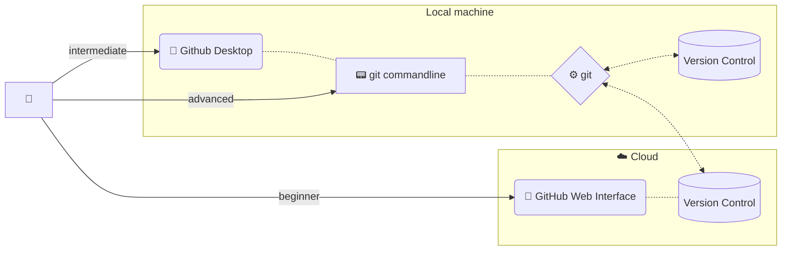

```mermaid
---
Title: Using git with Github
---

flowchart LR

subgraph Local[Local machine]
git{"⚙️ git"}
gitcli["📟 git commandline"]
GHDT("📲 Github Desktop")
VCS[("Version Control")]
end

subgraph cloud["☁️ Cloud"]
GHWI("🧭 GitHub Web Interface")-.-
CVCS[(Version Control)]
end

GHDT-.-gitcli-.-git

User["👤"]-->|intermediate|GHDT
User["👤"]-->|beginner|GHWI
User["👤"]-->|advanced|gitcli
git<-.->CVCS & VCS
```
